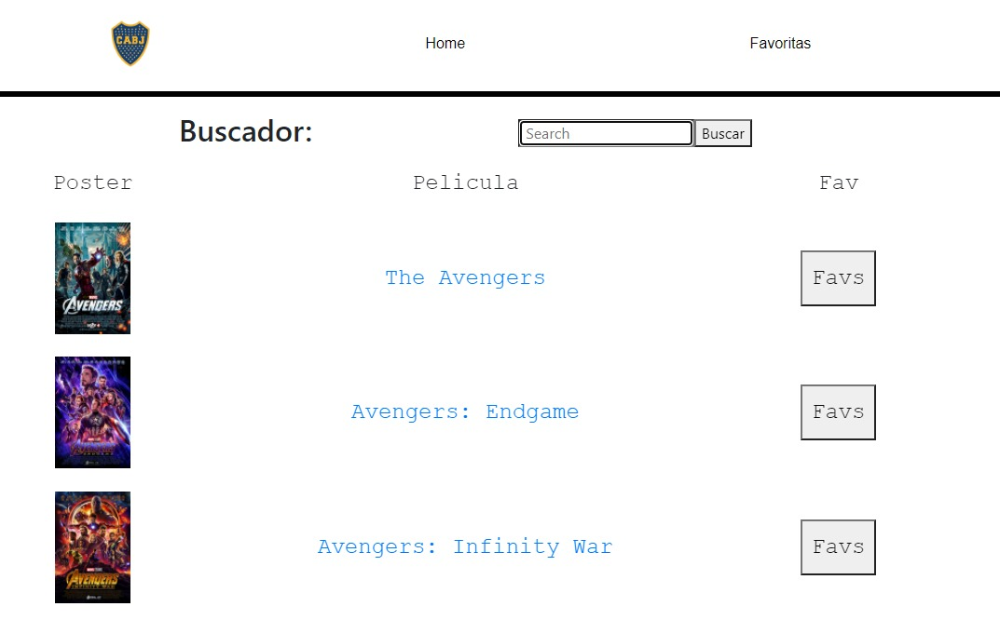
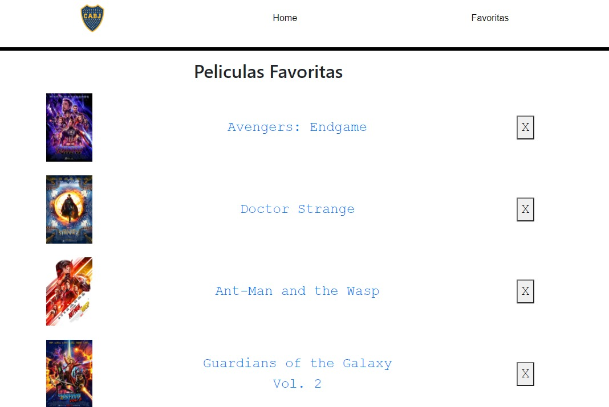

# Proyecto de Peliculas OMDb API

Se creo un pequeño proyecto en REACT-REDUX para buscar peliculas, ver su informacion y guardarlas en favoritos

1. Instalar dependencias
2. Crear las carpetas con los componentes
3. Crear el store y envolver la aplicacion con el provider
4. Crear el ruteo en app.js
5. El componente Buscador tendra un input para ingresar la pelicula a buscar y saldran todos los resultados abajo.
6. En el Action creo la accion q se despacha en el componente, y en el Reducer se modifica el estado.
7. Cada pelicula tiene un link propio para mostrarnos detalles de la misma.
8. La hoja de favoritos nos mostrara todo el listado que hemos creado al clickear en cada pelicula
9. Darle ESTILOS a cada componente.

key: 6d022ee2

.
.
.
